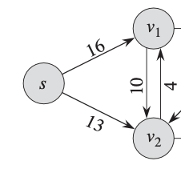
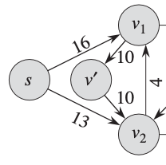
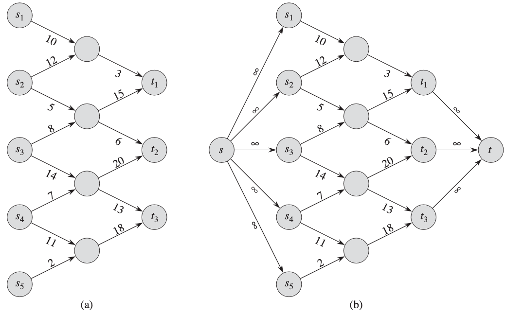
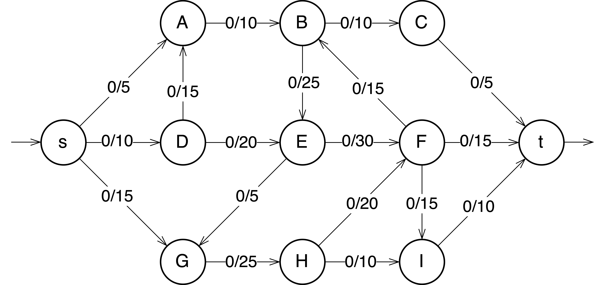
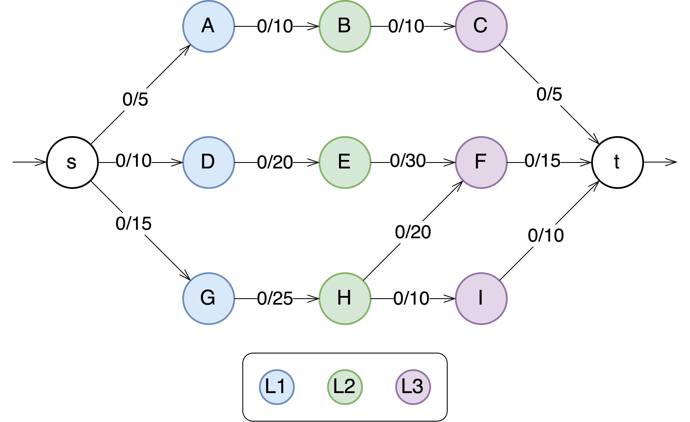
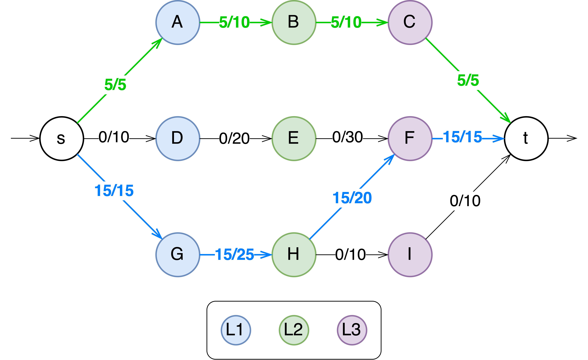
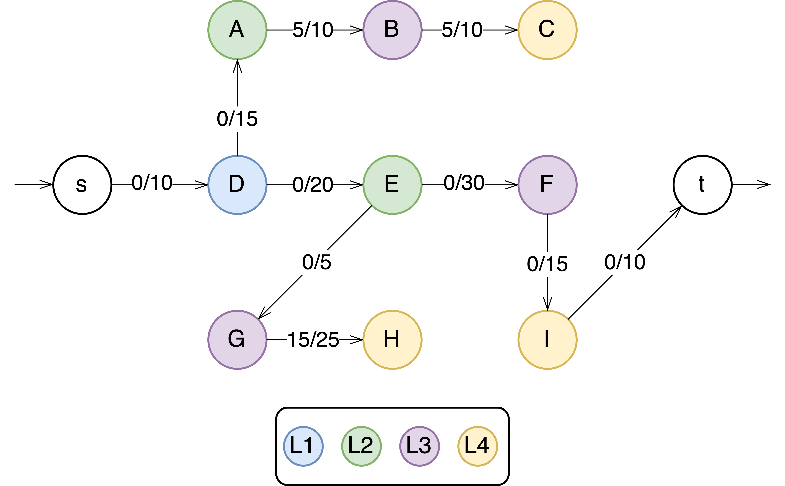
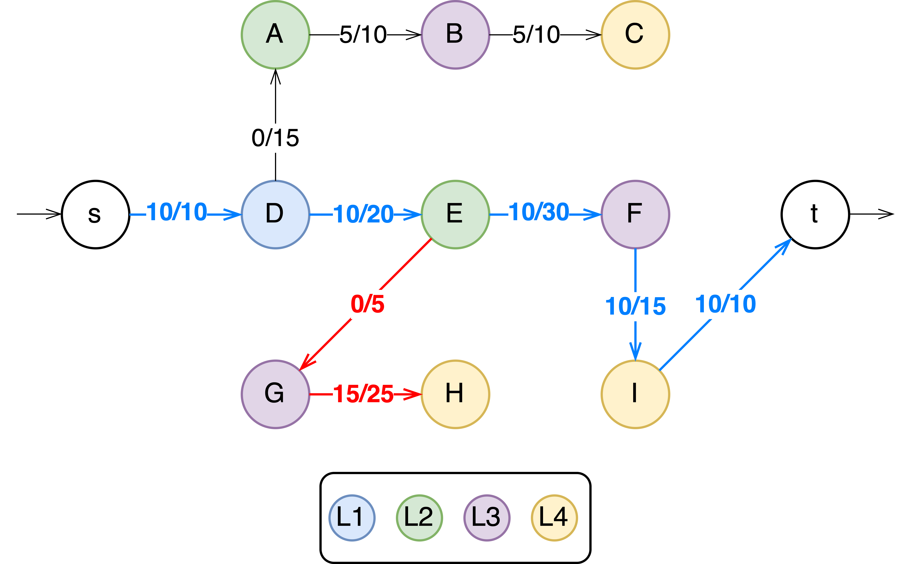

    <a href="index.html">Home</a>
    <a style="margin-left:2.0em; text-decoration: underline;" href="braindumps.html">Brain Dumps</a>
    <a style="margin-left:2.0em;" href="media.html">Media</a>

---

Recently, I have been dabbling a bit with graph algorithms to solve a very specific problem, and a 
professor came up with the idea to use Maximum Flow algorithms. These are my notes on Dinic's algorithm, adapted from:

[1] Thomas H. Cormen, Charles E. Leiserson, Ronald L. Rivest, and Clifford Stein. 2009. [Introduction to Algorithms](https://dl.acm.org/doi/10.5555/1614191), Third Edition (3rd. ed.). The MIT Press

[2] [Dinic's Algorithm](https://youtu.be/M6cm8UeeziI) by William Fiset.

# Maximum-Flow

In the maximum-flow problem we wish to compute the greatest rate at which we can ship material from the source to the sink without violating any capacity constraints. 

## Flow networks and flows

A flow network is a directed graph in which the edges have a non-negative capacity. We distinguish two vertices in a flow network: the *source* $$s$$ and the *sink* $$t$$. For each vertex the flow network contains a path from the source to the sink. The graph is connected and all vertices other than $$s$$ have at least on entering edge. 

More formally, let $$G = (V,\;E)$$ be a flow network with a capacity function $$c$$. Let $$s$$ be the source of the network, and let $$t$$ be the sink. A *flow* in $$G$$ is a real-valued function $$f : V \times V \rightarrow \mathbb{R}$$ that satisfies the following two properties: 

1. Capacity Constraint: for all $$u, v \in V$$ we require $$0 \leq f(u, v) \leq c(u, v)$$, i.e., the flow from one vertex to another must be nonnegative and must not exceed the given capacity.
   
2. Flow Conservation: for all $$u \in V \setminus \{s, t\}$$ we require $$\sum_{v \in V} f(v, u) = \sum_{v \in V} f(u,v)$$, i.e., the total flow into a vertex other than the source or sink must equal the total flow out of that vertex — informally, “flow in equals flow out.”

When $$(u, v) \notin E$$ there can be no flow from $$u$$ to $$v$$ and $$f(u,v) = 0$$. 

If $$E$$ contains an edge $$(u, v)$$ then there is no edge $$(v, u)$$ in the reverse direction (antiparallel edges). 

This is solved by choosing one of the two antiparallel edges, in this case  and s$$(v_1, v_2)$$, and split it by adding a new vertex $$v'$$ and replacing edge $$(v_1, v_2)$$ with the pair of edges $$(v_1, v')$$ and $$(v', v_2)$$. The capacity of both new edges is set to the capacity of the original edge. 

The resulting network satisfies the property that if an edge is in the network, the reverse edge is not.

    
    

---

## Networks with multiple sources and sinks

We can reduce the problem of determining a maximum flow in a network with multiple sources and multiple sinks to an ordinary maximum-flow problem. 

The following figure shows how to convert a multiple source and multiple sink network to an ordinary flow network. This is done by adding:

- a *supersource* $$s$$ with a directed edge $$(s, s_i)$$ having capacity $$c(s, s_i) = \infty$$ or each $$i = 1, 2, ..., n$$.
- and a *supersink* $$t$$ with a directed edge $$(t_i, t)$$ having capacity $$c(t_i, t) = \infty$$ for each $$i = 1, 2, ..., n$$.

Intuitively, any flow in the network in (a) corresponds to a flow in the network in (b), and vice-versa. 

    

## Maximum Flow $$-$$ Dinic’s Algorithm

Dinic's algorithm is a strongly polynomial maximum flow algorithm with a runtime of $$O(\mid V\mid ^2.E)$$. The main idea behind this algorithm is to guide augmenting paths from $$s \rightarrow t$$ using a *level graph*, greatly reducing the runtime. 

The way the algorithm determines which edges make progress towards the sink and which do not is by building a level graph. The levels of the graph are those obtained by doing a BFS from the source. 

Furthermore, an edge is only part of the level graph if it makes progress towards the sink. That is, the edge must go from a node at level  $$L$$  to another edge at level  $$L + 1$$. This requirement prunes backwards edges and “sideways” edges (grey edges in the figure).

Backwards and sideways edges are omitted from the level graph. The goal is to go from the source to the sink as quick as possible. 

### Steps

1. Construct a level graph by doing a BFS from the source to label all the levels of the current flow graph. 
2. If the sink was never reached while building the level graph, then stop and return the maximum flow. 
3. Using only valid edges in the level graph, do multiple DFSs from $$s \rightarrow t$$ until a **blocking flow** is reached, and sum over the bottleneck values of all the augmenting paths found to calculate the maximum flow. 
4. Repeat steps 1 - 3.

    

        <a style="font-weight:bold;">Blocking Flow</a>
        A flow in which every possible augmenting path from the source to the sink is filled to capacity.
    

    

        <a style="font-weight:bold;">Augmenting Path</a>
        A path from the source to the sink along which additional flow can be sent, increasing the total flow in the network. 
    

---

    Once every augmenting path is filled to capacity, the flow is said to be blocked, hence the term "blocking flow.” 

### Example: Finding the maximum flow of the following graph with [Dinic’s Algorithm](https://www.youtube.com/watch?v=M6cm8UeeziI&t=212s)

    

---

#### Building the level graph with a DFS (i.e., saving the each node's minimum distance to the source node)

    
    

        <table border="2.5px">
            <tbody>
                <tr>
                    <td style="width: 52px;">&nbsp;A: 1</td>
                    <td style="width: 52px;">&nbsp;D: 1</td>
                    <td style="width: 52px;">&nbsp;G: 1</td>
                </tr>
                <tr>
                    <td style="width: 52px;">&nbsp;B: 2</td>
                    <td style="width: 52px;">&nbsp;E: 2</td>
                    <td style="width: 52px;">&nbsp;H: 2</td>
                </tr>
                <tr>
                    <td style="width: 52px;">&nbsp;C: 3</td>
                    <td style="width: 52px;">&nbsp;F: 3</td>
                    <td style="width: 52px;">&nbsp;I: 3</td>
                </tr>
            </tbody>
        </table>
    

This is not just a regular BFS: even when the node was previously visited, if the path progresses towards the sink, it should be added (H → F). Recall: *…”the level graph consists of all edges which go from L to L+1 in level and have remaining capacity > 0”*

1. The sink was reached, continue. 
2. Traverse the level graph by doing multiple DFS from $$s \rightarrow t$$ until a blocking flow is reached. 
   
    **First Iteration:**

    
    **[1] $$s \rightarrow A \rightarrow B \rightarrow C \rightarrow t$$**
    (green)

    Bottleneck value = $$min(5-0,\;10-0,\;10-0,\;5-0) = 5$$

    Update the graph with the **new** flow values. 

    **[2] $$s \rightarrow G \rightarrow H \rightarrow F \rightarrow t$$**
    (blue)
    
    Bottleneck value = $$min(15-0,\;25-0,\;20-0,\;15-0) = 15$$

    Update the graph with the **new** flow values. 

    **[3] $$s \rightarrow A \rightarrow B \rightarrow C \rightarrow t$$**

    We have reached a **blocking flow**.  

    We should now reset and rebuild the level graph with the new capacities reflected on the original graph. 

    

        
    

    **Second Iteration: Updated level graph; Repeat step 3 on all valid edges**

    

        
        

            <table border="2.5px">
                <tbody>
                    <tr>
                        <td style="width: 52px;">&nbsp;A: 2</td>
                        <td style="width: 52px;">&nbsp;D: 1</td>
                        <td style="width: 52px;">&nbsp;G: 3</td>
                    </tr>
                    <tr>
                        <td style="width: 52px;">&nbsp;B: 3</td>
                        <td style="width: 52px;">&nbsp;E: 2</td>
                        <td style="width: 52px;">&nbsp;H: 4</td>
                    </tr>
                    <tr>
                        <td style="width: 52px;">&nbsp;C: 4</td>
                        <td style="width: 52px;">&nbsp;F: 3</td>
                        <td style="width: 52px;">&nbsp;I: 4</td>
                    </tr>
                </tbody>
            </table>
        

    

    **[1] $$s \rightarrow D \rightarrow E \rightarrow F \rightarrow I \rightarrow t$$**

    Bottleneck value = $$min(10,\;20,\;30,\;15) = 10$$

    Update the graph with the **new** flow values. 
    

    
    We could also have chosen (red): 
    $$s \rightarrow G \rightarrow H \rightarrow F \nrightarrow$$
    and reach a <b>dead end</b>. If this was the case, we should <b>backtrack</b> (until we find an edge leading to a different node) and keep going until we reach the sink.
    

    
     

[Even et al.](https://link.springer.com/chapter/10.1007/11685654_10) suggested pruning dead ends when backtracking to avoid reaching them multiple times.

By the end of this phase, if we inspect the graph we notice another blocking flow has been reached, When we try to build another level graph, we can’t find a path from $$s \rightarrow t$$. The algorithm has converged and the maximum flow has been found.
