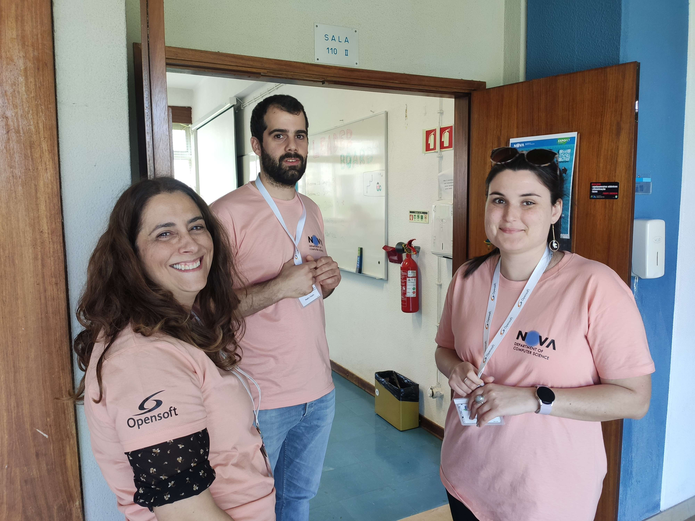
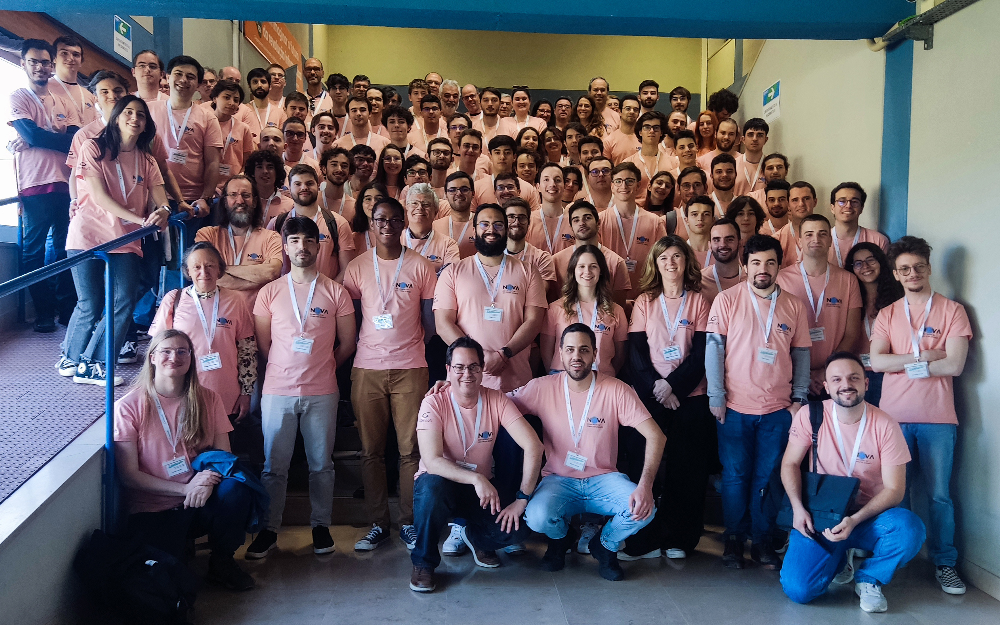
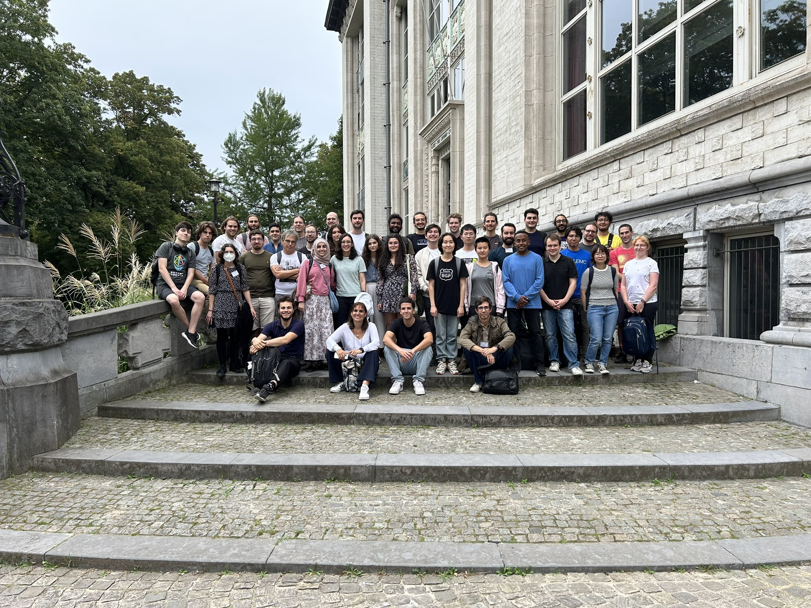
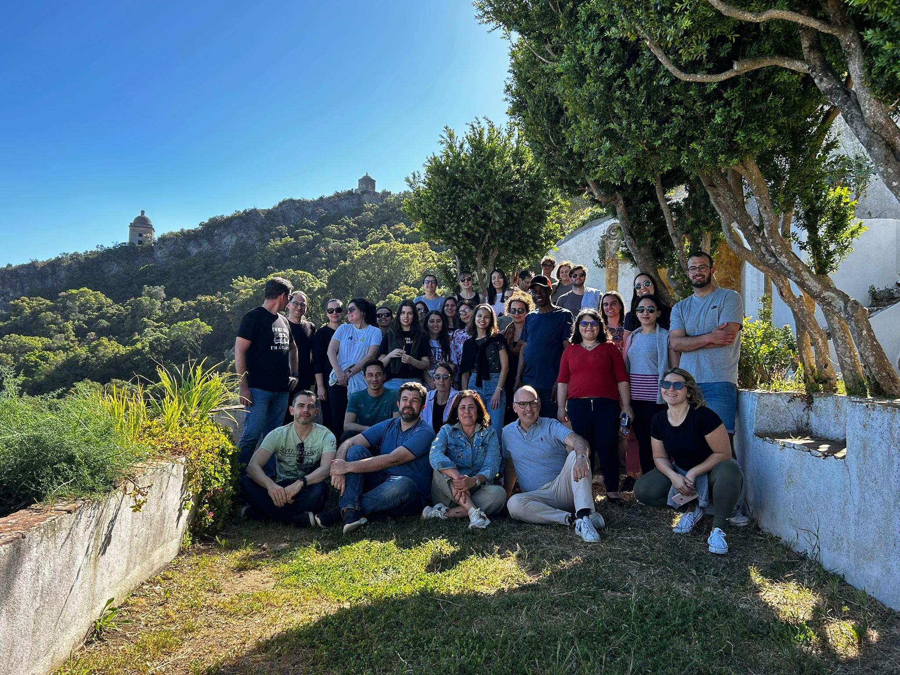
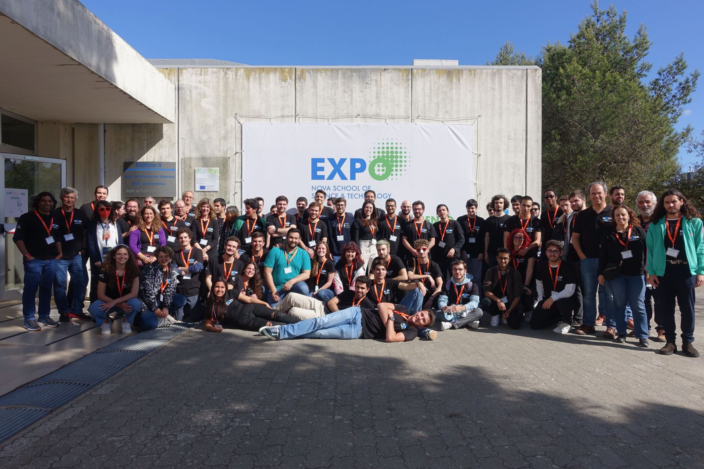

    <a href="index.html">Home</a>
    <a href="publications.html">Publications</a>
    <a href="open-msc-topics.html">Open MSc Topics</a>
    <a href="braindumps.html">Brain Dumps</a>
    <a href="media.html" style="text-decoration: underline;">Media</a>

---

## TAROT Summer School 24 @ Università degli Studi di Bergamo -- Italy 

--- 

## ISCE 24 @ CCB, Belém -- Portugal 

From left to right: Marko Ivanković (Google; University of Passau), Philipp Straubinger (University of Passau), and Ana Ribeiro. 

You may think we were discussing an important topic. We were talking about pink water bottles.
 

---

## EXPO FCT 2024 - Coding Fest, Caparica -- Portugal 

From left to right: Carla Ferreira, Pedro Fouto, and Ana Ribeiro. 

## EXPO FCT 2024 - Open Day @ NOVA FCT, Caparica -- Portugal 

---

## First Summer School on Distributed and Replicated Environments 2023 @ Vrije Universiteit, Brussels -- Belgium

---

## Research Skills & Development Course 2023 @ Arrábida Monastery, Sesimbra -- Portugal

---

## EXPO FCT 2023 - Open Day @ NOVA FCT, Caparica -- Portugal 

----