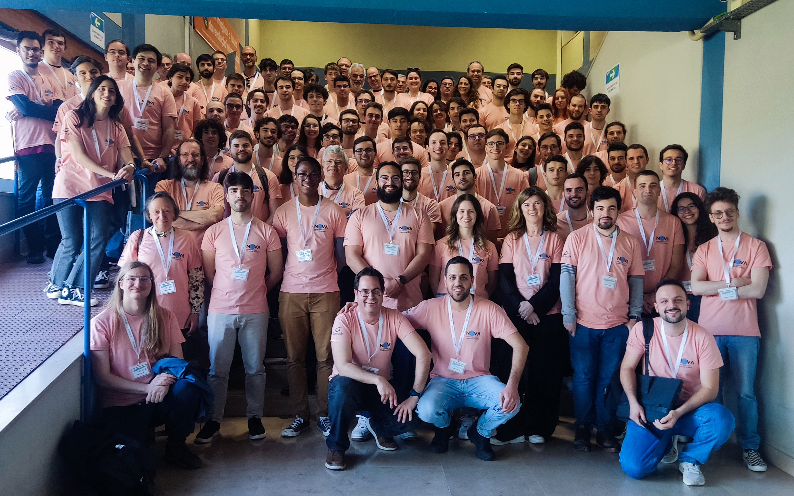
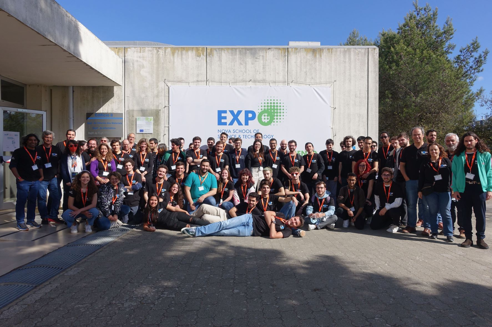

    <a href="index.html">Home</a>
    <a style="margin-left:2.0em;">Brain Dumps</a>
    <a style="margin-left:2.0em; text-decoration: underline;" href="media.html">Media</a>

---

## ISCE 24 @ CCB, Belém -- Portugal 

From left to right: Marko Ivanković (Google; University of Passau), Philipp Straubinger (University of Passau), and Ana Ribeiro. 

You may think we were discussing an important topic. We were talking about pink water bottles.
 

## EXPO FCT 2024 - Open Day @ NOVA FCT, Caparica -- Portugal 

## EXPO FCT 2024 - Coding Fest, Caparica -- Portugal 

From left to right: Carla Ferreira, Pedro Fouto, and Ana Ribeiro. 

---

## First Summer School on Distributed and Replicated Environments 2023 @ Vrije Universiteit, Brussels -- Belgium

---

## Research Skills & Development Course 2023 @ Arrábida Monastery, Sesimbra -- Portugal

---

## EXPO FCT 2023 - Open Day @ NOVA FCT, Caparica -- Portugal 

----